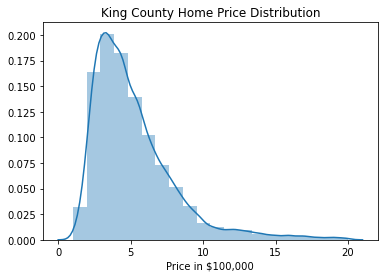
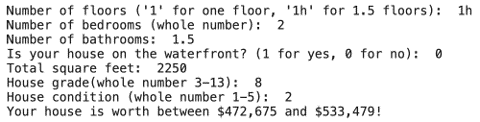

# King County Housing - Pricing Predictions

## Overview


### Repository Navigation
- [Data Folder Includes:](Data)
    - [Original Dataset](Data/kc_house_data.csv)
    - [Modified Dataset](Data/Master_Data_Table_v2.csv)
    - [Training Dataset](Data/Train_Table.csv)
    - [Testing Dataset](Data/Test_Table.csv)


- Notebooks: [Summary Notebook](Notebooks/Master_Notebook_2.ipynb)
    - [Explore Data](Notebooks/King_County_Housing_Data_EDA.ipynb)
    - [Clean Data](Notebooks/Create_Master_Table_and_Split_Train_Test.ipynb)
    - [Determine Confidence Intervals](Notebooks/Confidence_Interval_with_inputs.ipynb)
    - [Train Regression](Notebooks/Training_Regression.ipynb)
    - [Make Prediction](Notebooks/Make_Prediction.ipynb)
    - [Visualizations](Notebooks/Visualizations)

- [Presentation](Presentation/Mod_2_Project.pdf)


### ReadMe Navigation

1. [Business Understanding](#Business-Understanding)
2. [Data Understanding](#Data-Understanding)
3. [Feature Engineering](#Feature-Engineering)
4. [Model & Prediction](#Model-&-Prediction)
5. [Conclusions](#Conclusions)
6. [Further Steps](#Further-Steps)
7. [Project Info](#Project-Info)

***

## Business Understanding

The context of this project is a boutique real estate firm opening in King County Washington, seeking to make a move into the market by gaining increasing their consumers. In order to do this, they've tasked their data scientists with creating a model which will predict the estimated housing price for potential clients. The desired output of this project is a simplified system which the UX team can implement on their website that will allow users to input a limited amount of known factors about their home, and output an estimated price range. They're hoping that the efficiency, accuracy, and speed of return for clients considering selling their home will 1) entice consumers towards the efficiency of their business, and 2) enable their real estate associates to quickly engage with potential clients based on model estimates. So our guiding questions were:

1. Which 5 are the top most influencing factors upon home price? 

2. Given data about these factors from the potential client's home, what will be the predicted selling price of their home?


***

## Data Understanding
The data given for this project came from housing sales data from King County Washington for houses sold between May 2014 and May 2015.  Combining the information revealed from the dataset with industry relevant knowledge revealed a few categories of features which we thought would have an impact upon the sales price of the house. The sets we used, specifically included 

1. [King County Government House Data](Data/kc_house_data.csv)
2. [King County GIS Open Data Platform](https://data.kingcounty.gov/)
3. [School Performance Data from Background Checks.org](https://backgroundchecks.org/top-school-districts-in-washington-2018.html)


Overall, the data provided included the sales price and other information for around 21,000 houses sold between May 2014 and My 2015.

An overall map of the data:


The distribution of prices looked like this:



### Data Categories
#### **Location**, location, location
What's the impact on the selling price if the home is in a top school district, in the Seattle metro area, or on the waterfront?

#### The **size** of the house in the fight...?
What size datapoints most impact the sales price of the house? Bedrooms, bathrooms, floors, basement space, etc?

#### **Quality**: I'll huff, and I'll puff, and...
...will your house be blown down? How effective can King County condition and grade values be in predicting the value of your home?


### Data Limitations
#### Date
The sales data we used was from Maay 2014 - May 2015. This would prevent us from being able to see any longer term trends in the change of housing price between years. Additionally, this analysis did not account for inflation. Finally, we would have liked to have more recent data to assess any pattern or trends in sales price impact by current events (pandemics, protests, politics).

#### Model Simplicity
The model goes for simplicity over predictive accuracy - so the model does not explain every variationin price. The business purpose is to enable people with limited information to get a general range, and allow the real estate firm to do the rest in terms of specifics. 

#### Price Range
We limited the data for the model to houses above worth more than 100,000 USD and less than 1,000,000. Given the business being boutique and new in the market, the business goal was refined to be worth initial investments, but not beyond the expertise of associates new to the Seattle scene.                                            


### Data Assumptions

Additionally, based on the business understanding and industry knowledge, we made several assumptions about the data in order to qualify the predictive accuracy of the model, including

#### Renovations were total
We assumed that homes marked as renovated by King County were total renovations - not just partial (e.g., kitchen, bathroom, etc.). 

#### Access to location data
We assumed that the potential client would know the location of their home.

***

## Feature Engineering
Given the categories of data listed above, we selected certain factors within the dataset, and created or found new features that would help to create a more accurate pricing model. The new features were:

1. Defining top school districts
2. Creating a "season sold" factor
3. Reshaping categorical values from continuous variables (e.g., grade/condition)
4. Combining features, like ratio of basement space to living space
5. Creating a user input function

***

## Model & Prediction

We used the Ordinary Least Squares Regression to create a model which would help determine the most impactful factors and help us more accurately predict the prices.

### Test Assumptions (Linearity, Multicollinearity)
In order for this model to work the most effectively, we evaluated it for linearity between factors, and multicollinearity between pairs of factors, which gave us the following:


### Iterate and Evaluate Models

After iterating through, and making adjustments to, and evaluating 3 regression models, we adopted the final one using the highest R-squared value as a measure of performance. With more time we could have further refined the model to account for what appears to be an exponential function from the residuals plot:


### Predict Values with Example Inputs

Given the model we produced, we were able to create functions that would take the user inputs and output a prediction. In this example, the potential client would input the numbers after the colon:





## Conclusions

The most predictive factors in home price were:

### Location
Price would increase by  180k USD for top 5 school district, by 210k for homes outside the city, and 480k for homes on the waterfront


### Home Size
Basement square footage is worth less than square footage above ground, and too many bedrooms could lower the value of the house.


### Quality
Homes with high grades (good architecture and build quality) are worth significantly more than lower grades, and homes in a very good condition have a relatively significant impact over just average homes.


### When to Sell
Homes sold in spring/summer sold significantly more than those sold in fall/winter - presumably from that gloomy Seattle rain :-P


## Further Steps

### Internal to Data Science Team
With less of a time constraint, we would:

1. Fix normality issues in model.
2. Fix heteroskedasticity issues in model.
3. Fix multicollinearity issues in model
4. Test effectiveness of model using test data.
5. Explore industry and create new features
5. Deploy consumer product

### For Real Estate Team
Given additional resources, we would recommend the following to the firm:

1. Collect additional relevant data around other factors, using expertise
2. Open up to home prices above 1 million
3. Provide more time-relevant data


## Project Info

Contributors: __[Alexander](https://www.linkedin.com/in/anewt/)__ __[Newton](https://github.com/anewt225)__, __[Jim](https://www.linkedin.com/in/james-fay/)__ __[Fay](https://github.com/jrf6xh)__

Languages  : Python

Tools/IDE  : Git, Powershell (Windows), Anaconda, Jupyter Notebook, Google Slides

Libraries  : numpy, pandas, matplotlib, seaborn, statsmodels, scipy, geopandas, descartes, shapely

Duration   : July 2020
Last Update: 07.10.2020


```python

```

